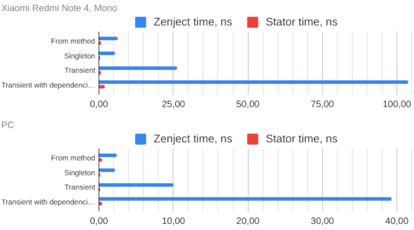

💉Stator IoC container
====================

Stator is an IoC container that uses code generation instead of reflection for managing and resolving dependencies as a basis.
> This repository is a UPM package.

Example
-------

1. Add TestFactory *partial* class

```csharp
using Stator;

namespace StatorExample
{
    public partial class TestFactory : ContainerFactory
    {
        public TestFactory()
        {
            AddTransient<Foo>();
            AddTransient<Bar>();
        }
    }

    public class Foo { }

    public class Bar
    {
        public Foo Foo;
        public Bar(Foo foo)
        {
            Foo = foo;
        }
    }
}
```

2. Focus unity editor for triger generation process, after compilation will generated partial classes in `./Assets/stator_generated/`

3. Use container:
```csharp
using StatorExample;
using UnityEngine;
using UnityEngine.Assertions;

public class SceneTest : MonoBehaviour
{
    void Start()
    {
        var container = new TestFactory();
        var bar = container.Resolve<Bar>();
        Assert.IsNotNull(bar);
        Assert.IsNotNull(bar.Foo);
        Debug.Log("Ok");
    }
}
```

4. Enjoy!

Performance
-----------

Performance testing was carried out on a PC and an Android device and 
not a development build. As a comparison, the ioc container `Zenject` 8.0.0 version was selected.

Device configurations:
 * PC: Laptop Huawei Matebook 13, intel core i5 8th, 8gb ddr4 ram.
 * Android device: Xiaomi Redmi Note 4 MTK

Result:



Settings
--------

To configure you need to add the file `.stator` to the root project folder. Config structure like ini file.  
Options:

|            Key          |                             Values                                   |
|-------------------------|--------------------------------------------------------------------- |
| AutoGeneratedFolder     | Relative path to the folder where the generated files will be stored |
| EnableDebugging         | true - enable debug logs                                             |
| DisabledAutoRefreshing  | true - auto generation will be disabled                              |

To manual start the code generation process, click the button in the window in `Window/Stator/Options`

Using
-----

To start using this package add a line to your `./Packages/manifest.json` like next sample:  
```json
{
  "dependencies": {
    "pro.kodep.stator": "https://github.com/k0dep/stator.git"
  }
}
```

Or use it as dependency from another packages and auto include by [Originer](https://github.com/k0dep/Originer) package
